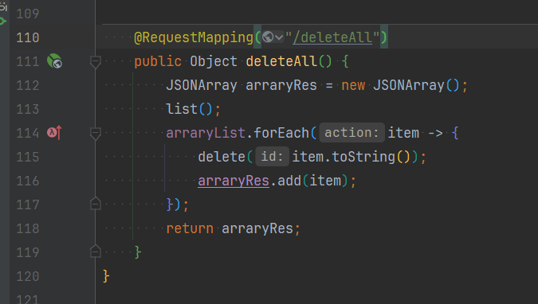
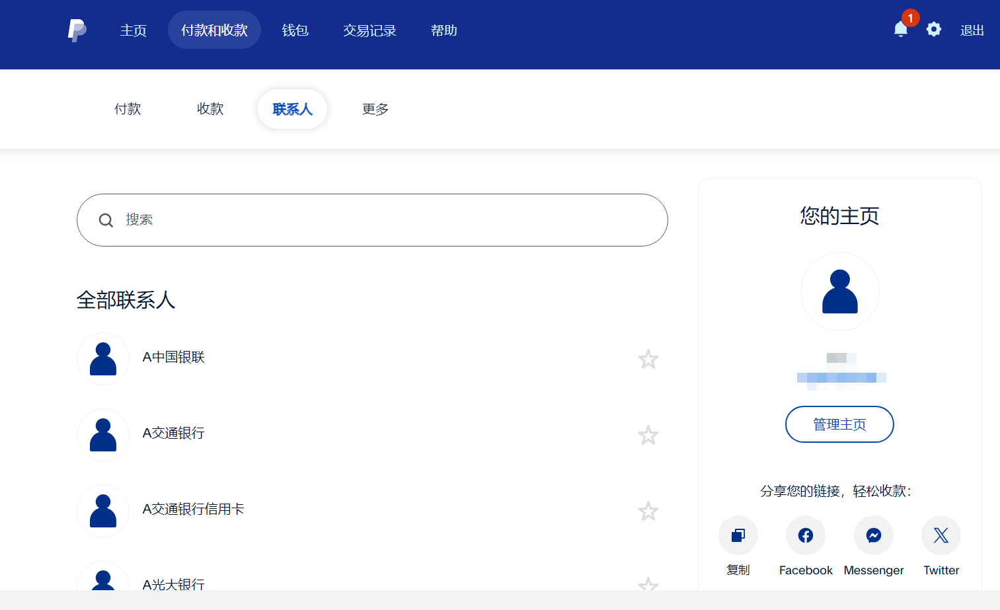
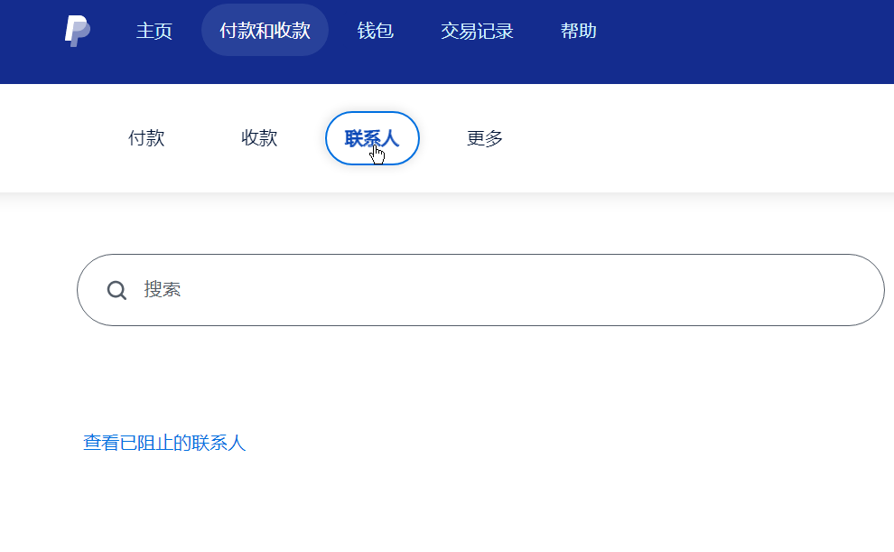

# 批量删除 paypal 联系人列表 | Delete paypal contact list in batches

paypal 莫名其妙保存了我的手机通讯录，我不想让它保存，但是 paypal 没有提供批量删除的功能，只能一个一个删除，于是写了这个爬虫。  
Paypal somehow saved my mobile phone address book. I didn't want it to be saved, but Paypal did not provide a batch deletion function, so I could only delete them one by one, so I wrote this crawler.

## 使用方法 | Usage
核心接口就两个： 获取联系人列表|删除联系人  
There are only two core interfaces: Get contact list | Delete contacts

代码：[src/main/java/cn/java666/bootapi/demos/web/PayPayController.java](src/main/java/cn/java666/bootapi/demos/web/PayPayController.java)  
code: [src/main/java/cn/java666/bootapi/demos/web/PayPayController.java](src/main/java/cn/java666/bootapi/demos/web/PayPayController.java)
```http
###
GET https://www.paypal.com/myaccount/transfer/peers?attemptId=
...

###
DELETE https://www.paypal.com/myaccount/transfer/peers/${id}?attemptId=
...

```
核心删除程序由免费的 github copilot 生成，我只是稍微修改了一下。  
The core remover was generated by the free github copilot and I just modified it slightly.  
  

效果如下  
  
  


运行之前需要替换 `PayPayController.java` 中的 `cookie` 和 `X_CSRF_TOKEN` 为你自己的，这两个参数需要从浏览器登录你的 paypal 账号，在开发者控制台查看请求头。  
Before running, you need to replace `cookie` and `X_CSRF_TOKEN` in `PayPayController.java` with your own. These two parameters need to log in to your paypal account from the browser and view the request headers in the developer console.
